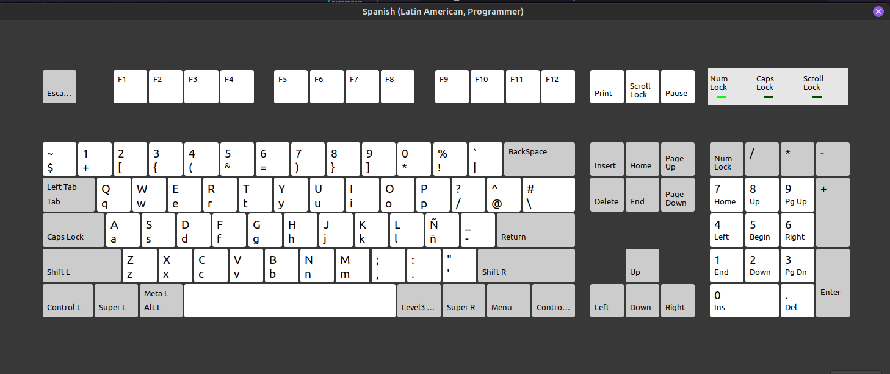

# keyboard ⌨

# English

Custom keyboard layout based on The Primeagen's "Real Programmer's Dvorak" in Linux Mint.

Made as a variant of the Spanish Latin American layout, it gives a better access to common symbols used in programming.

Unlike The Primeagen's setup, it uses the QWERTY layout which, despite being slower in comparison to other layouts when typing, has more compatibility
at the moment of using keyboard shortcuts. Of course, shortcuts with special symbols probably will change but it's not as drastic as completely using another layout.

## Install

### Ubuntu

Before doing anything, please add another layout (the us one for example) in case something doesn't go right at the moment of configuration.
Also, the following instructions require you to open these files as super user with any editor you like (VSCode usually is problematic about using it as super user, so try with Vim or Nano).

Copy the `latam-prog` file's contents and paste them at the end of at the end of `/usr/share/x11/xkb/symbols/latam`.

Next, open `/usr/share/x11/xkb/rules/evdev.xml`, find where it says latam and add the Latin American Programmer variant as one of the variants.
It should look something like this:

```xml
<layout>
  <configItem>
    <name>latam</name>
    ...
  </configItem>
  <variantList>
    <variant>
      <configItem>
        <name>latam-prog</name>
        <description>Spanish (Latin American, Programmer)</description>
      </configItem>
    </variant>
  </variantList>
```

## Preview 🦊



***

# Español

Teclado personalizado basado en "Real Programmer's Dvorak" de The Primeagen en Linux Mint.

Hecho como una variante del teclado latinoamericano, brinda un mejor acceso a los símbolos comunes utilizados en la programación.

A diferencia de la configuración de The Primeagen, utiliza la configuración QWERTY que, a pesar de ser más lento en comparación con otros diseños al escribir, tiene más compatibilidad.
al momento de usar atajos de teclado. Por supuesto, los atajos con símbolos especiales probablemente cambiarán, pero no es tan drástico como usar completamente otra configuración

## Instalación

### Ubuntu

Antes de hacer algo, por favor añade otro teclado (el de EEUU por ejemplo) en caso de que algo no salga bien al
momento de configurar todo.
También, las siguientes instrucciones requieren que abras estos archivos como usuario con derechos elevados (administrador) con cualquier editor de tu preferencia (VSCode es problemático al momento de hacer eso asi que usa Vim o Nano).

Copia los contenidos de `latam-prog` y pégalos al final del archivo `/usr/share/x11/xkb/symbols/latam`.

Después, abre `/usr/share/x11/xkb/rules/evdev.xml`, encuentra donde diga latam y añade el teclado de "Latin American Programmer" como una de las variantes.
Debería verse asi:

```xml
<layout>
  <configItem>
    <name>latam</name>
    ...
  </configItem>
  <variantList>
    <variant>
      <configItem>
        <name>latam-prog</name>
        <description>Spanish (Latin American, Programmer)</description>
      </configItem>
    </variant>
  </variantList>
```

## Previsualización 🦊


